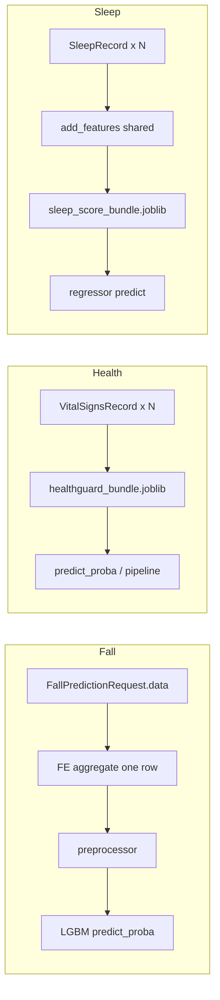

# Kế hoạch làm mới backend Fall / Health / Sleep (Python 3.12, joblib) — bản ổn định

## Tra cứu Context7 và tài liệu “mới” (bắt buộc trong giai đoạn code)

Context7 là MCP/API lấy snippet docs theo phiên bản thư viện (tránh cú pháp Pydantic v1 / FastAPI cũ).

- **Trong Cursor:** bật MCP server Context7 (nếu workspace đã cấu hình). Khi implement từng phần, tra các thư viện: **FastAPI** (lifespan, `HTTPException`, dependency), **Pydantic v2** (`model_validate`, `Field`, `ConfigDict`), **pydantic-settings** (`BaseSettings`, `SettingsConfigDict`, `env_nested_delimiter`), **scikit-learn** (`joblib`, `Pipeline.transform`), **LightGBM** / **CatBoost** (`predict_proba` / `predict`).
- **Nếu chưa có MCP:** dùng trực tiếp site docs tương đương (ví dụ `fastapi.tiangolo.com`, `docs.pydantic.dev`) — cùng mục tiêu: **chỉ** pattern Pydantic v2 + FastAPI hiện tại.
- **Ghi vào PR/commit:** ghi chú ngắn lib đã đối chiếu (ví dụ “Pydantic v2 Field constraints”) để sau này upgrade tiếp có neo.

---

## Nguồn artifact model (canonical)

**Thư mục gốc trong repo:** [healthguard-ai/Modelok](healthguard-ai/Modelok)

| Module | Thư mục | File bắt buộc (`.joblib` — không dùng `.pkl` cho inference) |
|--------|---------|----------------|
| Fall | `healthguard-ai/Modelok/fall/` | `fall_bundle.joblib` |
| Health | `healthguard-ai/Modelok/healthguard/` | `healthguard_bundle.joblib` |
| Sleep | `healthguard-ai/Modelok/Sleep/` | `sleep_score_bundle.joblib` |

Cấu trúc bên trong mỗi bundle (dict keys, pipeline sklearn, v.v.) **chốt sau artifact audit** — có thể giống fall (`preprocessor` + `model` trong một file). Nếu trên đĩa vẫn có thêm `sleep_score_preprocessor.joblib` tách riêng, config giữ thêm một `Path` tùy chọn nhưng **chỉ** joblib, không pickle `.pkl` riêng cho health.

Metadata tùy chọn cùng thư mục: `fall_metadata.json`, `sleep_score_metadata.json` — dùng cho `model-info` / metrics.

**Convention ổn định (chốt một):**

- **Đường model mặc định:** luôn `BASE_DIR / "healthguard-ai/Modelok/..."` như bảng trên.
- **CSV / JSON mẫu:** tiếp tục dưới `data/runtime/<module>/` và `data/datasets/` (không trộn với Modelok).
- Deploy chỉnh path bằng biến môi trường `HEALTHGUARD_*` trỏ tới bản copy trên server nếu cần — **không** thêm second default trong code.

### Nguyên tắc: không fallback model

- Một backend inference duy nhất mỗi module; **không** thử Keras → joblib hay ONNX → joblib.
- Thiếu file / lỗi unpickle → `status: unavailable`, `503` trên predict, log lỗi có `path` và exception type (không leak stack ra client).
- Xoá hẳn config + import: TensorFlow/Keras fall, `onnxruntime` cho health/sleep, field `sleep_onnx_path`, `healthguard.onnx`, v.v.

---

## Bối cảnh → mục tiêu

| Module | Hiện tại | Mục tiêu |
|--------|----------|----------|
| Fall | Keras + scaler ([fall_service.py](app/services/fall_service.py)) | `fall_bundle.joblib` (preprocessor + LGBM), FE aggregate một cửa sổ như [a/models/fall/fall_modeling.py](a/models/fall/fall_modeling.py) |
| Health | ONNX ([health_service.py](app/services/health_service.py)) | `healthguard_bundle.joblib` (một entrypoint; encoder/model bên trong bundle theo audit) |
| Sleep | ONNX + preprocessor ([sleep_service.py](app/services/sleep_service.py)) | `sleep_score_bundle.joblib` (+ preprocessor joblib riêng **chỉ nếu** artifact không gộp); `model.predict`; FE đồng bộ một nguồn với training |

**Contract HTTP/JSON:** giữ nguyên như [docs/API_REFERENCE.md](docs/API_REFERENCE.md) (path, schema field, mã lỗi). Cập nhật ví dụ `model_name` / `inference_backend` / mô tả runtime trong [app/main.py](app/main.py).

---

## Thứ tự triển khai (ổn định, ít churn)

1. **Artifact audit (blocking):** `joblib.load` từng file trong Modelok; ghi ra bảng nội bộ (kiểu object, keys dict, `feature_names_in_`, `classes_`). Không viết service inference trước bước này.
2. **Dependencies + Python:** `pyproject.toml` `requires-python >=3.12`; pin `requirements.txt` (hoặc lockfile nếu team dùng `uv lock`); loại TF/onnxruntime; cài môi trường sạch và `python -c "import lightgbm, sklearn, catboost"`.
3. **Config:** chỉnh [app/config.py](app/config.py) — path Modelok, xoá field cũ; thresholds giữ nested settings.
4. **Shared sleep FE:** một file nguồn `add_features` (import từ đó trong `sleep_service`; training repo mirror hoặc re-export) — **một** công thức `mid_sleep_hour` / datetime.
5. **Services:** fall → health → sleep (theo độ phụ thuộc sklearn).
6. **App shell:** [app/main.py](app/main.py) lifespan chỉ `load()` ba service; mô tả OpenAPI.
7. **Docs:** [docs/API_REFERENCE.md](docs/API_REFERENCE.md) + lệnh dump OpenAPI trong tài liệu (đã có pattern).
8. **Scripts:** [scripts/build_runtime_samples.py](scripts/build_runtime_samples.py) CLI hoặc sync datasets.
9. **Tests:** unit service **không** chỉ “chạy qua được” — mỗi service nhận **sample input thật** (file `data/runtime/.../iot_sample_input.json` đã build, hoặc bản rút gọn trong `tests/fixtures/` vẫn đúng cột/thứ tự training) và assert **đúng/sai có thể phán đoán**: shape response, keys khớp `API_REFERENCE`, clip 0–100 (sleep), xác suất trong \([0,1]\), mapping class từ `classes_` khi mock trả `predict_proba` cố định (**golden**). Mock `joblib.load` / inject fake bundle trả output đã biết để test logic FE → preprocessor → đọc cột positive **không phụ thuộc** artifact thật trên CI. Router: `TestClient` với cùng sample; optional so khớp OpenAPI.

---

## 1. Python 3.12 và dependencies

- `requires-python = ">=3.12"` trong [pyproject.toml](pyproject.toml).
- [requirements.txt](requirements.txt): **pin** phiên bản tối thiểu đã kiểm tra trên 3.12 (FastAPI, Pydantic 2.x, pydantic-settings 2.x, numpy/pandas/sklearn tương thích).
- **Không** `tensorflow`, **không** `onnxruntime` cho stack này.
- **CatBoost:** thêm nếu object trong `sleep_score_bundle` là CatBoost sklearn wrapper; nếu chỉ `numpy` + `pickle` thuần thì vẫn cần đúng package tương thích lúc dump.

---

## 2. Cấu hình ([app/config.py](app/config.py))

- `MODELOK_ROOT = BASE_DIR / "healthguard-ai" / "Modelok"`.
- Fall: `fall_bundle_path = MODELOK_ROOT / "fall" / "fall_bundle.joblib"`.
- Health: `health_bundle_path = MODELOK_ROOT / "healthguard" / "healthguard_bundle.joblib"` (một path; không còn cặp `.pkl`).
- Sleep: `sleep_bundle_path = MODELOK_ROOT / "Sleep" / "sleep_score_bundle.joblib"`; `sleep_preprocessor_path` chỉ khi audit xác nhận file tách `sleep_score_preprocessor.joblib` vẫn cần; `sleep_metadata_path` tùy chọn JSON.
- Sample paths: giữ `data/runtime/.../iot_sample_input.json` như hiện tại.
- Dùng **pydantic-settings** với `env_prefix="HEALTHGUARD_"`, `env_nested_delimiter="__"` cho thresholds (đã có pattern — đối chiếu Context7 khi thêm field `Path`).

---

## 3. Services (một đường, response shape cũ)

### 3.1 Fall

- DataFrame per-timestep từ `SensorSample` (đủ cột training, gồm `room_occupancy`).
- `sequence_id = 0` cho cả cửa sổ → aggregate một dòng → `bundle["preprocessor"].transform` → `bundle["model"].predict_proba`.
- Xác định cột positive từ `model.classes_` (document sau audit).
- `predicted_activity` / `activity_probability`: `null`.

### 3.2 Health

- `joblib.load(healthguard_bundle.joblib)` — một object đã audit (thường dict: `model`, `label_encoder` / `preprocessor`, … — **chốt keys** sau bước audit).
- Map nhãn high-risk qua encoder hoặc `classes_` tùy cấu trúc bundle; `predict_proba` trên đúng estimator.
- Không onnxruntime; không đọc `.pkl` riêng cho inference.

### 3.3 Sleep

- `add_features` từ module chung; drop `TARGET` + `DROP_COLS` khớp training.
- `sleep_score_bundle.joblib`: dùng preprocessor/model theo keys đã audit (luồng giống fall: `preprocessor.transform` → `model.predict` nếu tách bên trong bundle). Nếu artifact training vẫn tách `sleep_score_preprocessor.joblib` trên đĩa, load thêm path đó — **chỉ** joblib.
- Clip 0–100; `classify_sleep_score` + thresholds settings.

---

## 4. FastAPI / Pydantic (cú pháp “mới” — neo Context7)

- **Lifespan** context manager cho load model (đã dùng — giữ, không quay lại `@app.on_event`).
- Schemas: Pydantic v2 `model_config = ConfigDict(...)` nếu cần; validate request bằng schema hiện có.
- Lỗi load model: message 503 ngắn, chi tiết trong log.

---

## 5. Docs & OpenAPI

- Cập nhật [docs/API_REFERENCE.md](docs/API_REFERENCE.md): ví dụ JSON `GET /health`, `model-info`, mô tả backend `lightgbm` / `catboost` / tương đương.
- Chạy lệnh dump `app.openapi()` sau thay đổi schema/description (ghi trong docs nếu cần file `openapi.json` committed).

---

## 6. Scripts dữ liệu

- [scripts/build_runtime_samples.py](scripts/build_runtime_samples.py): argparse `--fall-csv`, `--health-csv`, `--sleep-csv` hoặc `--dataset-profile v1|v2` map [data/datasets](data/datasets) → copy vào runtime rồi build samples.
- Không đổi format public của các endpoint.

---

## 7. Kiểm thử & DoD

### 7.1 Định nghĩa hoàn thành (DoD)

- **DoD:** cả ba service load được với artifact đầy đủ trên 3.12; `POST` predict trả đúng keys trong API_REFERENCE; `GET /health` phản ánh `loaded`/`unavailable`; không còn import TF/onnx trong app.
- Test thiếu artifact: 503 + message ổn định.
- (Tuỳ chọn) So khớp response `model-info` với schema hoặc snapshot JSON.

### 7.2 Unit service — “thông minh”: sample input + kỳ vọng kiểm chứng được

- **Nguồn sample:** ưu tiên tái dụng payload đã chuẩn hoá từ [scripts/build_runtime_samples.py](scripts/build_runtime_samples.py) / `data/runtime/<module>/…` (đúng schema public). Nếu CI cần nhẹ: copy tối thiểu vào `tests/fixtures/*.json` hoặc factory Pydantic, **giữ nguyên** tên cột và semantics (fall: đủ timestep; health/sleep: đúng field vital/sleep record).
- **Mock có chủ đích:** thay vì mock “trả bất kỳ”, inject model/preprocessor giả có `predict_proba` / `predict` / `transform` trả **tensor cố định** (ví dụ proba `[0.2, 0.8]` với `classes_` đã biết) → unit test assert đúng nhãn high-risk, đúng cột positive, đúng làm tròn/xử lý threshold — như vậy biết **đúng hay sai** khi refactor pipeline.
- **Lớp không cần model thật:** pure FE (fall aggregate, sleep `add_features`) có thể test với bảng nhỏ trong code + assert số cột / giá trị công thức (ví dụ `mid_sleep_hour`) so với kỳ vọng tính tay.
- **Lớp tích hợp mỏng:** sau khi có sample + mock ổn định, một vài test optional `pytest.mark.slow` load artifact thật local (không bắt buộc CI) để smoke end-to-end.
- **conftest:** fixture đọc sample JSON một lần; fixture “fake bundle” dùng chung cho fall/health/sleep.

---

## 8. Rủi ro còn lại

- **Joblib (pickle bên trong):** toàn bộ bundle `.joblib` phải dump trên cùng major Python và tương thích sklearn/LGBM/CatBoost; nếu lỗi → re-export trên 3.12. Không phụ thuộc file `.pkl` tách cho health.
- **Tên cột DataFrame:** fall/sleep phải khớp `feature_names_in_` sau khi fit preprocessor.
- **Sleep FE drift:** giải quyết bằng module `add_features` dùng chung (mục thứ tự triển khai).
