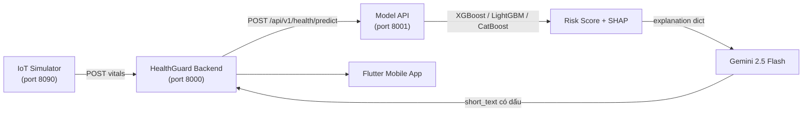

# HealthGuard Model API

Backend **FastAPI** cung cấp suy luận AI cho ba domain sức khỏe: **Fall Detection / Health Risk / Sleep Scoring** — dựa trên model joblib trong `models/` và tích hợp **Gemini AI** để sinh giải thích tiếng Việt có dấu.

---

## 1. Tổng Quan

### Kiến trúc



### Domain Model

| Domain | Model | Input | Output |
|--------|-------|-------|--------|
| **Health Risk** | XGBoost + LightGBM | Vital signs (HR, SpO2, BP, RR…) | Risk score 0–100, SHAP waterfall |
| **Fall Detection** | CatBoost | IMU window 50 Hz (50 samples) | fall/not_fall, confidence |
| **Sleep Scoring** | LightGBM | Sleep session features (18 fields) | Sleep score 0–100, risk level |

---

## 2. Tính Năng Chính

- **Suy luận đa domain:** Ba pipeline độc lập — health, fall, sleep — chạy cùng một tiến trình FastAPI.
- **SHAP Explanations:** Mỗi dự đoán đi kèm waterfall SHAP chi tiết (`shap.values[]`) và `top_features` tổng hợp.
- **Gemini AI Explanation:** Sau khi có SHAP, gọi Gemini 2.5 Flash để tạo `short_text` / `clinical_note` / `recommended_actions` bằng tiếng Việt có dấu tự nhiên. Tự động fallback về template nếu Gemini timeout hoặc lỗi.
- **Sample Cases:** Thư mục `data/runtime/*/cases/` chứa JSON mẫu sẵn để paste vào Swagger — không cần tự gõ payload.
- **Backward-compatible contract:** Header `X-Risk-Contract-Version` theo dõi phiên bản wire-format. Xem `docs/API_REFERENCE.md`.

---

## 3. Cài Đặt & Chạy

### Bước 0 — Cấu hình môi trường

```powershell
Copy-Item .env.example .env
notepad .env   # Điền GEMINI_API_KEY
```

### Bước 1 — Tạo venv & cài dependencies

```powershell
py -3.12 -m venv .venv
.\.venv\Scripts\Activate.ps1
pip install -r requirements.txt
```

> **Lưu ý:** `scikit-learn` được ghim `>=1.6.1,<1.7.0` để tương thích bundle đã train. Không tự nâng version.

### Bước 2 — Khởi động server

```powershell
uvicorn app.main:app --reload --host 127.0.0.1 --port 8001
```

| Endpoint | URL |
|----------|-----|
| Swagger UI | http://127.0.0.1:8001/docs |
| Health check | http://127.0.0.1:8001/health |
| Health predict | `POST /api/v1/health/predict` |
| Fall predict | `POST /api/v1/fall/predict` |
| Sleep predict | `POST /api/v1/sleep/predict` |

---

## 4. Scripts Tiện Ích

```powershell
# Kiểm tra bundle model load được
python scripts\inspect_modelok.py

# Sinh lại JSON mẫu trong data/runtime/*/cases/
python scripts\build_health_sample_cases.py
python scripts\build_fall_sample_cases.py
python scripts\build_sleep_sample_cases.py
```

---

## 5. Test

```powershell
pytest
# Hoặc chỉ một domain
pytest tests/test_health_service.py -v
```

---

## 6. Changelog

- **2026-04-27 — Gemini AI Explanation (branch `TP/REFACTOR-CORE`):**
  - Thêm `app/services/gemini_explainer.py` — gọi Gemini 2.5 Flash sinh giải thích tiếng Việt có dấu từ SHAP context.
  - Wire vào `build_explanation()` trong `prediction_contract.py` — Gemini → fallback template nếu lỗi/timeout.
  - Thêm `google-genai>=1.0.0` vào `requirements.txt`.
  - Cung cấp `.env.example` với `GEMINI_API_KEY`.

- **2026-04-27 — SHAP & Contract Versioning:**
  - Thêm SHAP waterfall response đầy đủ (`shap.values[]`, `base_value`, `prediction_value`).
  - `model_request_id` (UUID) cho end-to-end log correlation.
  - `top_features` với `reason_overrides` theo từng domain.

- **2026-04-02 — Sleep AI Integration:**
  - Pipeline giấc ngủ hoàn chỉnh — LightGBM score + sleep risk mapping.
  - `SleepRiskAdapter` chuẩn hóa output về `NormalizedExplanation`.

---

## 7. Ghi Chú

- **PowerShell execution policy:** `Set-ExecutionPolicy -ExecutionPolicy RemoteSigned -Scope CurrentUser`
- **Linux/macOS:** `source .venv/bin/activate`, đổi `\` thành `/` trong đường dẫn script.
- **Port mặc định:** Model API chạy port **8001**, HealthGuard Backend chạy port **8000** — không dùng chung.
